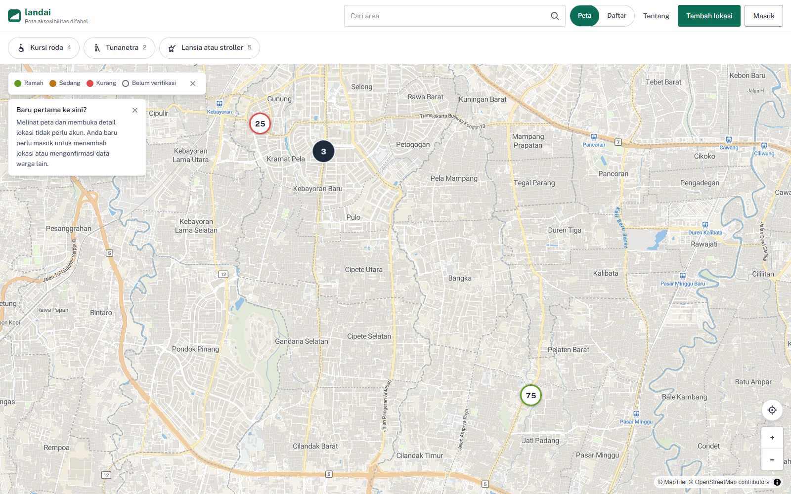
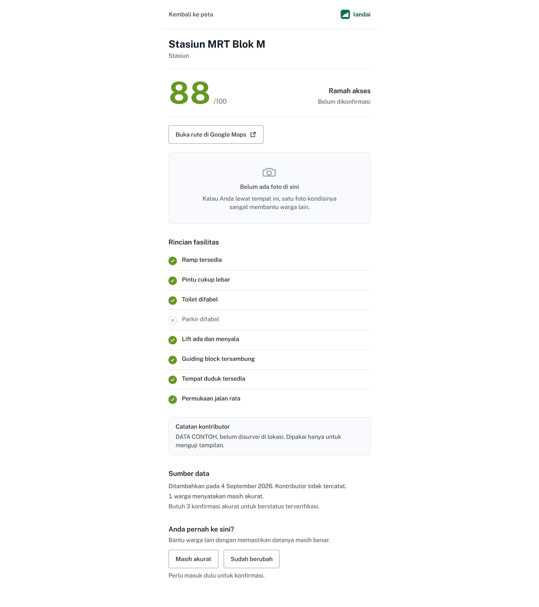
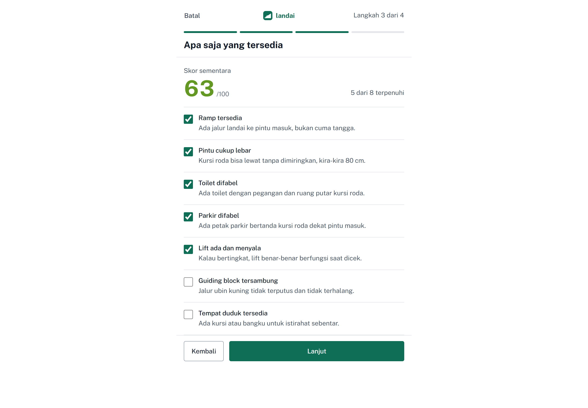

<div align="center">

  # landai
  ### Peta aksesibilitas difabel berbasis kontribusi warga

  [](https://landai-zeta.vercel.app)
  [](https://github.com/VanoStudio/landai)
  [](LICENSE)

  **Submission for ITECHNO CUP 2026 - Web Development**

  **By [ISI: nama tim resmi kalau ada, kalau tidak pakai nama tiga anggota]**

</div>

---

## 📋 Daftar Isi

- [Tentang Proyek](#-tentang-proyek)
- [Fitur Unggulan](#-fitur-unggulan)
- [Demo & Screenshot](#-demo--screenshot)
- [Teknologi](#-teknologi)
- [Arsitektur Sistem](#-arsitektur-sistem)
- [Instalasi & Setup](#-instalasi--setup)
- [Penggunaan](#-penggunaan)
- [API Documentation](#-api-documentation)
- [Testing](#-testing)
- [Tim Pengembang](#-tim-pengembang)
- [Lisensi](#-lisensi)

---

## 👥 Tim Pengembang

| Nama | Peran | Kontribusi |
|------|-------|------------|
| **Vano** | Project Lead & Full Stack Developer | Merancang dan membangun seluruh aplikasi, basis data, dan alur pengujian |
| **Husein** | Riset Lapangan | Turun langsung mensurvei lokasi, mengambil foto dan mengisi data aksesibilitas sungguhan |
| **Dakara** | Peneliti Kriteria Aksesibilitas | Menyusun kriteria penilaian dan bahan rujukan regulasi tentang aksesibilitas |

---

## 🎯 Tentang Proyek

### Latar Belakang

Berdasarkan data Badan Pusat Statistik tahun 2024, lebih dari 17,8 juta jiwa penduduk Indonesia adalah penyandang disabilitas. Undang-Undang Nomor 8 Tahun 2016 tentang Penyandang Disabilitas menjamin hak aksesibilitas bagi mereka, dan Peraturan Menteri PUPR Nomor 14/PRT/M/2017 secara khusus mewajibkan bangunan gedung umum menyediakan sarana kemudahan seperti ramp, jalur pemandu, dan toilet yang dapat diakses. Meski aturan sudah ada, tidak ada sumber informasi terbuka yang bisa diandalkan warga untuk mengetahui apakah sebuah tempat umum benar-benar mematuhi standar tersebut sebelum mereka datang ke sana. Penyandang disabilitas, lansia, dan orang tua dengan stroller sering kali baru mengetahui sebuah tempat tidak ramah akses setelah tiba di lokasi.

### Solusi yang Ditawarkan

landai adalah peta interaktif berbasis kontribusi warga. Siapa saja bisa menandai sebuah lokasi, mengisi daftar periksa delapan fasilitas aksesibilitas, dan mengunggah foto langsung dari kamera. Sistem menghitung skor aksesibilitas secara otomatis dari data yang diisi, menampilkannya sebagai penanda berwarna di peta, dan menjaga kepercayaan data lewat konfirmasi berulang dari warga lain, bukan lewat tim verifikasi tertutup.

### Tujuan Proyek

- 🎯 **Tujuan Utama**: Menyediakan sumber informasi aksesibilitas tempat umum yang terbuka, terus diperbarui, dan bisa dipercaya, dikumpulkan bersama oleh warga.
- 📊 **Target Pengguna**: Penyandang disabilitas, lansia, dan orang tua dengan stroller sebagai pencari informasi; warga umum sebagai kontributor data.
- 💡 **Value Proposition**: Belum ada crowdmap aksesibilitas serupa di Indonesia. landai tidak menunggu satu pihak memetakan seluruh kota, tapi membiarkan warga yang sudah berada di suatu tempat langsung melaporkan kondisinya.

---

## ✨ Fitur Unggulan

### Fitur Utama

| Fitur | Deskripsi | Keunggulan |
|----------|--------------|---------------|
| **Peta interaktif dengan skor aksesibilitas** | Setiap lokasi ditandai warna hijau, amber, atau merah sesuai skor, dan bentuk terisi atau berongga sesuai status verifikasi | Warna dan bentuk dipakai bersamaan, sehingga tetap terbaca oleh mata yang tidak membedakan warna |
| **Formulir kontribusi empat langkah** | Menandai titik lewat GPS perangkat atau geser manual, mengisi identitas tempat, delapan daftar periksa fasilitas, dan foto wajib dari kamera langsung | Foto tidak bisa diambil dari galeri, mencegah data yang tidak diverifikasi di lapangan |
| **Verifikasi komunitas otomatis** | Status lokasi naik menjadi terverifikasi setelah tiga warga berbeda mengonfirmasi, dan turun kembali kalau ada laporan sudah berubah | Kepercayaan data ditentukan komunitas, bukan satu admin, dan tetap bisa diperbarui seiring waktu |
| **Penyaringan berdasarkan kebutuhan** | Filter terpisah untuk kebutuhan kursi roda, tunanetra, dan lansia atau stroller, bisa digabung sekaligus | Setiap filter dihitung dari kombinasi fasilitas yang relevan, bukan sekadar kategori umum |

### Fitur Tambahan

- **Papan kontributor** - Menampilkan warga paling aktif menambahkan lokasi, sebagai bentuk pengakuan komunitas.
- **Pembaruan terbuka** - Siapa pun yang masuk bisa membantu memperbarui daftar periksa dan foto sebuah lokasi, tercatat siapa pengubahnya, sementara nama, kategori, dan koordinat tetap hanya bisa diubah pemilik asli.
- **Deteksi kemungkinan duplikat** - Memperingatkan kontributor kalau lokasi serupa sudah ada di dekatnya sebelum menyimpan data baru.
- **Buka rute ke Google Maps** - Menyerahkan navigasi ke Google Maps lewat satu tautan, karena landai fokus pada data aksesibilitas, bukan membangun ulang sistem navigasi.
- **Masuk dengan Google** - Alternatif pendaftaran cepat selain email dan kata sandi.

---

## 📸 Demo & Screenshot

### Live Demo

🔗 **[Kunjungi Website](https://landai-zeta.vercel.app)**

### Screenshot Aplikasi

<div align="center">
  
  <p><em>Peta utama - penanda berwarna sesuai skor aksesibilitas</em></p>

  
  <p><em>Halaman detail lokasi dengan rincian delapan fasilitas</em></p>

  
  <p><em>Formulir tambah lokasi empat langkah</em></p>
</div>

> **Catatan tangkapan layar.** Ketiganya diambil dari tautan hosting yang sedang
> berjalan, bukan dari mockup, tetapi memakai data yang ada saat ini: tiga lokasi
> contoh beserta beberapa lokasi kiriman awal. **Tangkapan ini belum final dan harus
> diambil ulang setelah data survei lapangan sungguhan masuk**, supaya yang terlihat
> adalah kondisi aksesibilitas yang benar-benar disurvei di tempat.

### Video Demo

📹 **[ISI: opsional, link video demo kalau sempat dibuat]**

---

## 🛠️ Teknologi

### Tech Stack

#### Frontend
```
Framework    : Nuxt 4 (Vue 3, Composition API)
Peta         : MapLibre GL JS dengan basemap MapTiler
Gaya         : Tailwind CSS 4
Sistem desain: Impeccable, menghasilkan PRODUCT.md dan DESIGN.md
```

#### Layanan data dan akun
```
Basis data   : Supabase (PostgreSQL)
Autentikasi  : Supabase Auth (email dan kata sandi, serta Google OAuth)
Penyimpanan  : Supabase Storage untuk foto lokasi
Keamanan     : Row Level Security pada seluruh tabel, ditegakkan di level basis data
Pencarian    : Nominatim OpenStreetMap, diakses lewat satu rute server Nuxt
```

Catatan: landai tidak membangun server backend terpisah. Sebagian besar operasi baca dan tulis data dilakukan langsung dari klien ke Supabase lewat pustaka resminya, diamankan oleh kebijakan Row Level Security, bukan oleh lapisan API kustom.

#### DevOps & Tools
```
Deployment   : Vercel
Pengujian    : Skrip end to end kustom berbasis Playwright, dijalankan lewat browser sungguhan
```

### Alasan Pemilihan Teknologi

| Teknologi | Alasan Pemilihan |
|-----------|------------------|
| **Nuxt 4** | Perenderan sisi server mempercepat tampilan pertama peta, dan menyediakan rute server bawaan tanpa perlu backend terpisah |
| **Supabase** | Autentikasi, basis data, dan penyimpanan foto tersedia dalam satu layanan, dengan Row Level Security dan trigger basis data memindahkan aturan kualitas data ke lapisan yang tidak bisa dilewati dari sisi peramban |
| **MapLibre GL JS** | Pustaka peta sumber terbuka tanpa keterikatan vendor, mendukung kontrol penuh atas gaya visual peta |
| **Impeccable** | Membantu memastikan sistem desain terarah dan tidak generik, sesuai filosofi visual yang dipilih untuk proyek ini |

### Dependencies Utama

```json
{
  "dependencies": {
    "@nuxtjs/supabase": "^2.0.10",
    "maplibre-gl": "^6.7.0",
    "nuxt": "^4.5.2",
    "vue": "^3.5.42",
    "vue-router": "^5.3.1"
  },
  "devDependencies": {
    "@tailwindcss/vite": "^4.3.3",
    "tailwindcss": "^4.3.3",
    "typescript": "^7.0.2"
  }
}
```

Tailwind dipasang lewat `@tailwindcss/vite`, bukan lewat modul `@nuxtjs/tailwindcss`,
karena modul itu masih terikat Tailwind v3 sedangkan proyek ini memakai v4 beserta
token `@theme`-nya.

---

## 🏗️ Arsitektur Sistem

### System Architecture

```
Peramban pengguna
   │
   ├─▶ Nuxt 4 (sisi server, perenderan awal halaman)
   │        │
   │        └─▶ server/api/geocode.get.ts ──▶ Nominatim OpenStreetMap
   │
   └─▶ Nuxt 4 (sisi klien, setelah hidrasi)
            │
            └─▶ Supabase (Auth, PostgreSQL, Storage)
                     │
                     └─▶ Row Level Security + trigger basis data
                              (hitung skor, buat profil, ubah status verifikasi)
```

### Database Schema

Lima tabel utama, didefinisikan lengkap pada schema.sql dan tambalannya:

- `profiles` - data akun, dibuat otomatis lewat trigger saat pendaftaran
- `locations` - lokasi, skor, status verifikasi, dan jejak pembaru
- `accessibility_checklist` - delapan fasilitas per lokasi, sumber perhitungan skor
- `location_photos` - foto lokasi, maksimal tiga per lokasi
- `confirmations` - konfirmasi akurasi dari warga, penentu naik turunnya status verifikasi

### Folder Structure

```
landai/
├── app/
│   ├── components/     # Komponen antarmuka, peta berakhiran .client.vue
│   ├── composables/     # Aturan skor, pengambilan data, pembacaan GPS, pengecilan foto
│   └── pages/           # Peta, tentang, masuk, daftar, tambah lokasi, detail, papan kontributor
├── server/
│   └── api/             # Rute server, satu di antaranya perantara pencarian tempat
├── docs/
│   ├── qa/               # Skrip pengujian end to end
│   └── screenshots/       # Tangkapan layar untuk dokumentasi
├── schema.sql             # Skema basis data awal
├── schema-patch-*.sql      # Tambalan basis data berurutan
├── PRODUCT.md              # Konteks produk untuk sistem desain
└── DESIGN.md               # Token desain dan filosofi visual
```

---

## ⚙️ Instalasi & Setup

Butuh **Node.js 20+**, akun **Supabase** gratis, dan akun **MapTiler** gratis untuk basemap.

```bash
git clone https://github.com/VanoStudio/landai.git
cd landai
npm install
cp .env.example .env      # lalu isi SUPABASE_URL, SUPABASE_KEY, NUXT_PUBLIC_MAPTILER_KEY
npm run dev
```

Basis datanya dipasang sekali jalan: tempel seluruh isi `schema-gabungan.sql` ke SQL Editor Supabase pada proyek baru, lalu Run. Satu berkas itu membuat seluruh tabel, trigger, Row Level Security, hak akses per kolom, dan bucket Storage sekaligus.

Aplikasi berjalan di `http://localhost:3000`.

> **Panduan lengkap ada di [SETUP.md](SETUP.md)**, mencakup pengaturan alamat pengalihan Supabase, masuk dengan Google, data contoh, penanganan masalah yang sering muncul, dan langkah deploy ke Vercel.

---

## 🚀 Penggunaan

### Menjalankan Aplikasi

```bash
npm run dev      # mode pengembangan
npm run build     # build produksi
npm run preview   # menjalankan hasil build secara lokal
```

### Panduan Pengguna

#### Mode Melihat (tanpa akun)

1. Buka aplikasi, peta langsung tampil penuh berisi lokasi yang sudah disurvei.
2. Pilih penyaring kebutuhan (kursi roda, tunanetra, atau lansia dan stroller) untuk menyaring lokasi yang relevan.
3. Ketuk sebuah penanda untuk melihat skor dan ringkasan fasilitas, atau lanjut ke halaman detail untuk rincian penuh.

#### Mode Kontribusi (perlu akun)

1. Daftar atau masuk, bisa lewat email atau akun Google.
2. Tekan tombol tambah lokasi, tentukan titik lewat GPS atau geser manual di peta.
3. Isi nama, jenis tempat, delapan daftar periksa fasilitas, dan ambil foto langsung dari kamera.
4. Simpan, lokasi langsung tampil di peta dengan status belum terverifikasi sampai dikonfirmasi warga lain.
5. Kontributor lain yang pernah ke lokasi yang sama bisa membantu memperbarui daftar periksa atau menambahkan foto, dan menekan tombol konfirmasi akurasi.

---

## 📚 API Documentation

landai tidak membangun REST API kustom penuh. Autentikasi dan seluruh operasi baca-tulis data lokasi dilakukan langsung dari klien ke Supabase lewat pustaka resminya, diamankan oleh kebijakan Row Level Security pada tiap tabel, bukan oleh lapisan endpoint kustom.

### Rute Server Kustom

Satu-satunya rute server yang dibuat khusus untuk proyek ini:

```http
GET /api/geocode?q=[nama tempat]
```

Rute ini meneruskan pencarian nama tempat ke Nominatim OpenStreetMap dari sisi server, karena tajuk pengenal aplikasi yang disyaratkan Nominatim tidak bisa disetel dari peramban, dan agar tidak terhalang kebijakan lintas asal.

### Contoh Permintaan

```javascript
const hasil = await fetch('/api/geocode?q=Blok M Plaza')
```

---

## 🧪 Testing

landai diuji lewat skenario ujung ke ujung memakai browser sungguhan dan akun uji nyata, bukan lewat cakupan unit test otomatis. Alasannya, yang paling mungkin patah di aplikasi ini justru hal yang tidak terlihat oleh unit test: aturan Row Level Security, trigger basis data, dan peta yang dirender WebGL. Area utama yang diuji mencakup alur akun, penyimpanan lokasi beserta foto dan skornya, ambang tiga konfirmasi untuk status terverifikasi, batas hak tulis antar pengguna, penyaringan kategori kebutuhan, dan tampilan responsif dari 320px sampai desktop. Skrip pengujiannya ada di [`docs/qa/`](docs/qa/) bagi yang ingin memeriksa lebih lanjut.

```bash
node docs/qa/uji-menyeluruh.mjs
```

---

## 📄 Lisensi

Proyek ini dilisensikan di bawah [MIT License](LICENSE) - lihat file LICENSE untuk detail lebih lanjut.

---

<div align="center">

  **Dibuat oleh Vano, Husein, dan Dakara untuk ITECHNO CUP 2026**

</div>